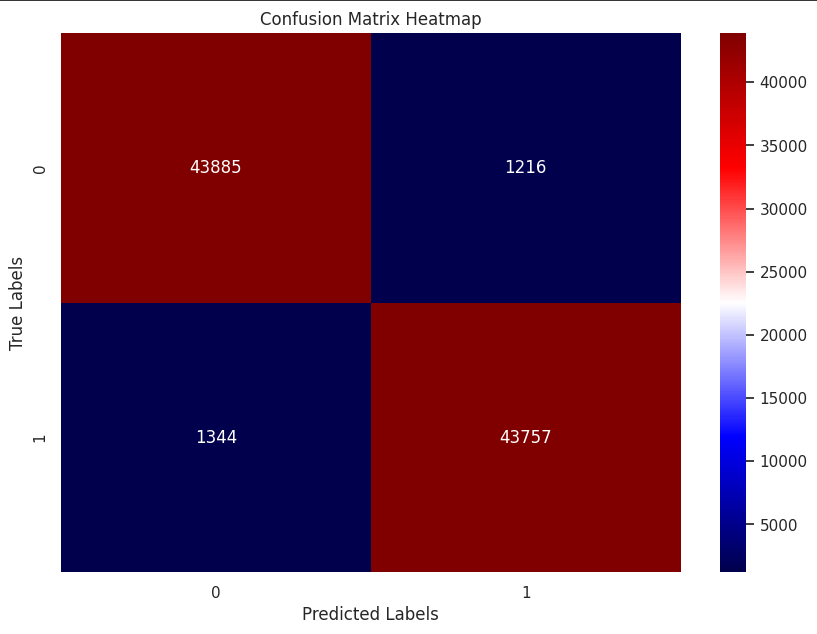
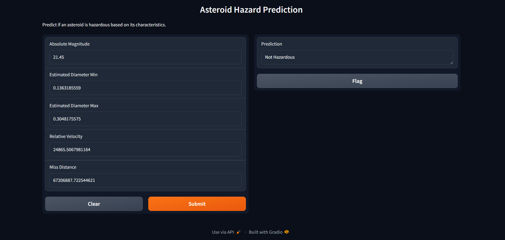

# Asteroid Hazard Prediction

This project predicts whether an asteroid is hazardous based on its characteristics using a machine learning model. The dataset used in this project is from NASA's nearest earth objects (1910-2024).

## Table of Contents

- [Project Overview](#project-overview)
- [Dataset](#dataset)
- [Installation](#installation)
- [Exploratory Data Analysis (EDA)](#exploratory-data-analysis-eda)
- [Model Training](#model-training)
- [Model Evaluation](#model-evaluation)
- [Deployment](#deployment)
- [Usage](#usage)
- [Contributing](#contributing)
- [License](#license)

## Project Overview

This project involves the following steps:
1. **Data Preprocessing**: Filling missing values, removing irrelevant columns, and handling outliers.
2. **Exploratory Data Analysis (EDA)**: Visualizing data distributions, class balance, and correlations.
3. **Feature Engineering**: Removing outliers from certain features.
4. **Model Training**: Using a Random Forest classifier with class balancing via SMOTE.
5. **Model Evaluation**: Measuring model performance with accuracy, classification report, and a confusion matrix.
6. **Deployment**: Deploying the model using Gradio for a user-friendly interface.

## Dataset

The dataset used in this project is sourced from Kaggle: [NASA Nearest Earth Objects (1910-2024)](https://www.kaggle.com/datasets/ivansher/nasa-nearest-earth-objects-1910-2024).

## Installation

1. Clone the repository:
   ```bash
   git clone https://github.com/your-username/asteroid-hazard-prediction.git
   cd asteroid-hazard-prediction
   ```

## Exploratory Data Analysis (EDA)

The EDA process includes:

- Visualizing Distributions: Histograms, box plots, and scatter plots to understand the data distribution.
- Correlation Analysis: Heatmaps to identify relationships between features.
- Class Balance: Checking for imbalance in the target variable.

## Model Training

The Random Forest model was trained using:

- Training Data: Processed data with balanced classes using SMOTE.
- Hyperparameter Tuning: Grid search for optimal parameters.
- Model Evaluation: Using cross-validation and splitting the dataset into training and testing sets.

## Model Evaluation

Model performance was evaluated based on:

- Accuracy: Achieved an accuracy of 97% on the test set.
- Classification Report: Precision, recall, and F1-score metrics.
- Confusion Matrix: To visualize the model's performance in classifying hazardous and non-hazardous asteroids.

**Confusion Matrix**




## Deployment

The model is deployed using Gradio for easy interaction. To run the deployment locally:

1. Ensure you have required libraries installed: `pip install gradio pickle pandas`
2. Open final_project.ipynb in Jupyter Notebook.
3. Run all cells to reproduce the analysis and model training.
4. Use the Gradio app for real-time predictions.
3. Open the provided local URL in your web browser to interact with the model.

**Gradio Interface**



## Usage

1. Open final_project.ipynb in Jupyter Notebook.
2. Run all cells to reproduce the analysis and model training.
3. Use the Gradio app for real-time predictions.

## Contributing

Contributions to this project are welcome. Please follow these steps:

1. Fork the repository.
2. Create a new branch for your feature or bug fix.
3. Make your changes and commit them with descriptive commit messages.
4. Push your changes to your fork.
5. Submit a pull request to the main repository.

## License

This project is open-source and available under the [MIT License](LICENSE).
